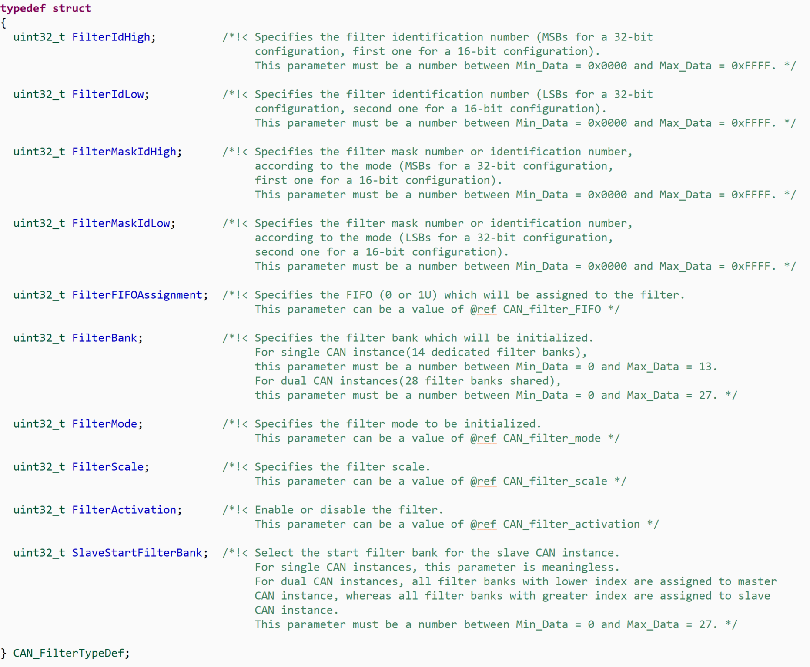
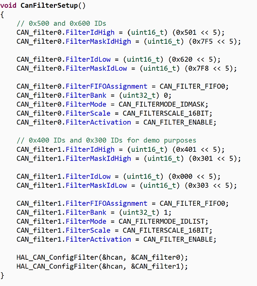
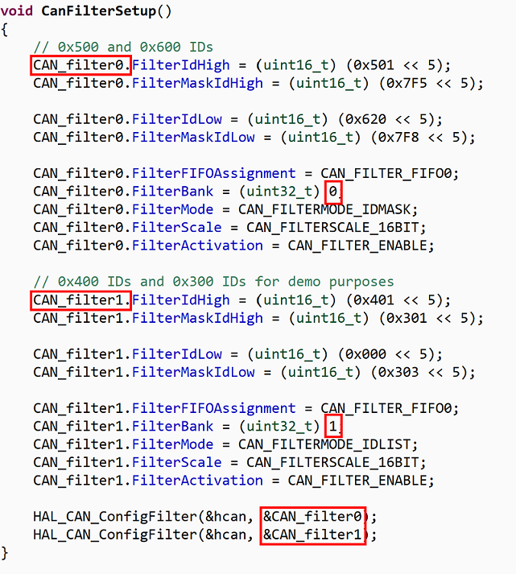

# CAN Filtering

- Page 653/1134 of [STM Reference Manual](https://www.st.com/resource/en/reference_manual/cd00171190-stm32f101xx-stm32f102xx-stm32f103xx-stm32f105xx-and-stm32f107xx-advanced-arm-based-32-bit-mcus-stmicroelectronics.pdf()) - How CAN Works in Detail
- Page 90/2173 of [HAL documentation](https://www.st.com/resource/en/user_manual/dm00105879-description-of-stm32f4-hal-and-ll-drivers-stmicroelectronics.pdf) - Available HAL Functions etc.

### About the Document

This document gives a higher-level overview of how the filtering process works for CAN. The document partially goes into the implementations of CAN filtering using firmware in STM32.

### General

Filtering CAN message is the process on the receiving end of a node where message identifiers are used to decide which messages the node wants to keep and discard.

_The components of a CAN data frame. These are what make up the CAN messages sent across the bus. The 11 bit ID is what we use to filter messages._

### Implementation In Code

This code shows the end results of understanding and implementing the CAN filtering system. It is suggested to preview this before understanding what is going on and revisit the example code after finishing the document.

To start, a CAN filter structure is defined by the user. The filtering process is implemented with a function that sets the values of the struct. Not all of the values need to be set, but the members of the CAN\_FilterTypeDef struct show the available features of CAN filtering using the HAL library.

_The members of the CAN\_FilterTypeDef struct._

_Example code for a function that assigns values to the members of CAN\_filter0 which is a CAN\_FilterTypeDef struct. Note that the code uses a combination of 2 filter banks, the first set in mask mode and the second set in list mode._

### Filters

A filter is essentially 64 bits of space that can be divided into 16 bit or 32 bit segments. CAN protocol allows for standard IDs (11 bit) and extended IDs (29 bit). For our case, we will only be using the 11 bit identifiers--assume &quot;ID&quot; refers to a standard ID. Furthermore, each ID takes up 16 bits of space.

The first 11 bits of a 16 bit filter are used for the ID. The bits of the ID would be the &quot;X&quot;s in the following, &quot;XXXX XXXX XXX0 0000&quot;. To get the ID to the first 11 bits of the 16 bit filter, we bit shift the ID over by 5.

_Bit shifting a 16 bit ID over by 5._

### Filter Scale

To be more technical than saying &quot;a filter is essentially 64 bits of space&quot;, the actual size of a filter in the registers is 32 x 2 bits. These bits can be used in 4 ways (ignore the first 2 because they use extended IDs):

- Filter 1 Extended ID in mask mode (32 bits for mask, 32 bits for filter)
- Filter 2 Extended IDs in list mode (32 bits for first ID, 32 bits for second ID)
- Filter 2 IDs in mask mode (16 bits for high filter, 16 bits for low filter, 16 bits for high mask, 16 bits for low mask)
- Filter 4 IDs in list mode (16 bits for first ID, 16 bits for second ID, third, fourth)

_STM32 documentation showing the different ways to configure those 64 total bits._

### List Mode (16 bit scale)

List mode is a 1 to 1 comparison between the ID received and the IDs you want to filter out. It can be thought of as an if statement that lets an exact ID be received. Each 16 bit filter allows you to let in a single ID. The terms &quot;high, low, id, and mask&quot; can be ignored in list mode (more on those in the next section).

For demonstration purposes, the 2 following sudo code blocks are very similar:

_Example of filtering 4 different IDs with list mode._

### Not Using All the Filters (List Mode)

If there aren&#39;t exactly 4 IDs to filter, the remaining filters cannot be left blank. In list mode, the excess filters should be left with duplicates. Leaving a filter with 0x000 would let through the ID 0x000. Even though letting through the 0x000 ID would not likely cause a problem, it is good practice to filter exactly what is intended. Empty filters are significantly more problematic with mask mode which will be discussed in the following section.

Continuing from the example above, if only 2 IDs needed to be filtered, the code would be more like the following:

_Example of filtering 2 different IDs with list mode._

### Mask Mode (16 bit scale)

Mask mode uses 2 components to filter a range of IDs. There is the mask and the filter. Filtering in mask mode, the ID is compared with the mask, then with the filter.

- The mask excludes certain bits. Excluded bits will not be looked at by the filter.
  - A value of 1 means to pass the bit onto the filter.
  - A value of 0 means to excluded the bit from comparison witht the filter.
- The filter is a 1 to 1 comparison between bits that have passed through the mask.
  - All 1s and 0s must match the filter exactly.

The following is an example that is simplified. Let&#39;s say IDs are 3 bits longs:

### High and Low in Mask Mode

Since the filters have 64 total bits, using a 16 bit scale will allow for 2 maks and 2 filters. The terms &quot;high&quot; and &quot;low&quot; are used to distinguish which mask corresponds to which filter. In short, the high mask decides which bits are looked at by the high filter, and the low mask decides which bits are looked at by the low filter.

### Not Using all the Filters (Mask Mode)

Similar to the section on not using all the filters in list mode, in mask mode, leaving a filter as 0x000 has the potential to let every incoming message through the filter. If a mask plus filter are not being used, make sure to use the same filter twice. Although different problems can arise with empty filters in mask mode, the solution is the same as duplicating filters in list mode.

_The high mask and filter are used to filter a range of IDs. Since the low mask and filter were not used, the same filter was used twice to fill in the empty space._

### Filter Banks

From the section about filter scale, we know that a single filter has a total of 64 bits. These bits can be made up of 4 x 16 bit filters in list mode, or 2 masks and 2 filters in 16 bit mask mode. If more filters are required, additional filters can be added. To add more filters, create a new CAN\_FilterTypeDef structure and increase its filter bank by 1. Make sure to configure the reception for all of the filters in the filter bank.

_Driver Interface Display (DID) filtering uses 2 filter banks to accommodate for a large number of received CAN IDs. Remember to configure both after assigning values to the structures._